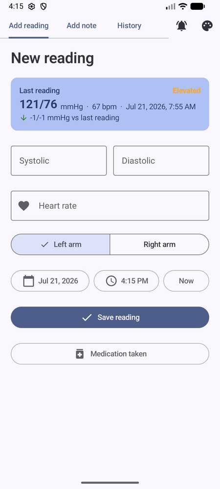
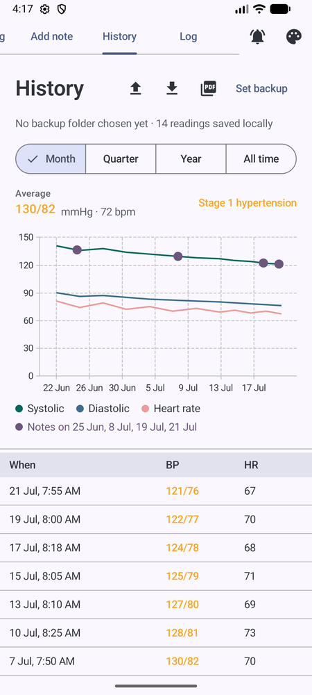
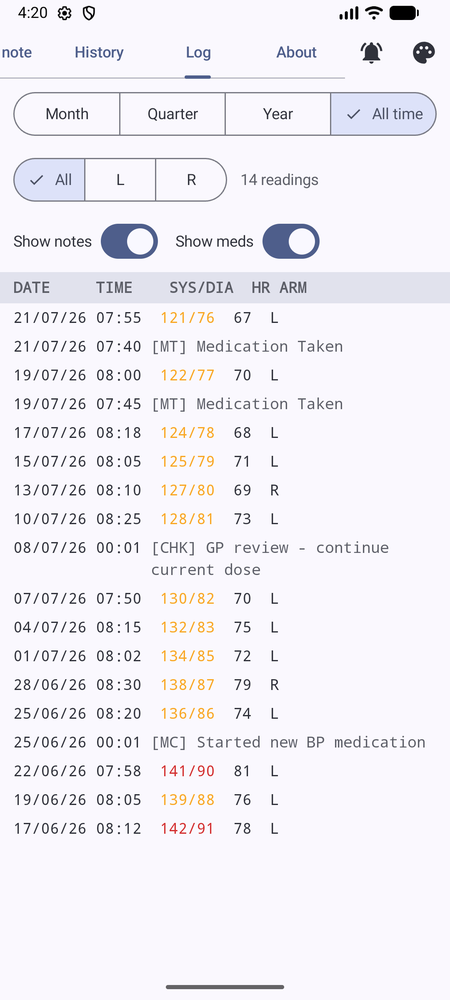
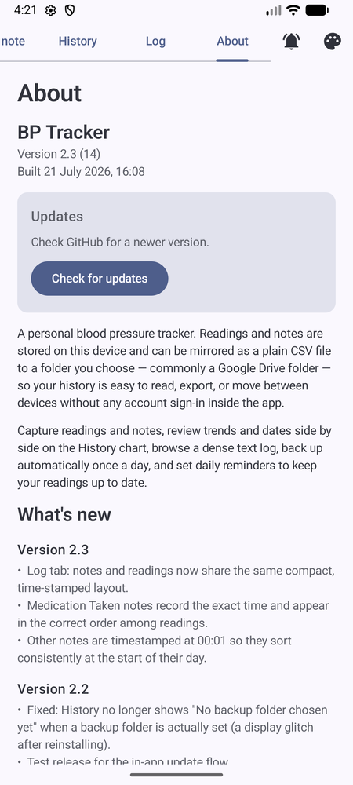
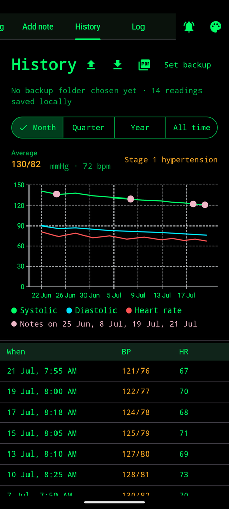

# BP Tracker

A personal Android blood-pressure tracker (Kotlin + Jetpack Compose, Material 3).

Readings and notes are stored locally in a Room database and can be mirrored as a plain,
human-readable CSV to a folder of your choice (e.g. a Google Drive folder) via the Storage
Access Framework — no account sign-in inside the app.

## Screenshots

| Add reading | History | Log | About | Console theme |
|:---:|:---:|:---:|:---:|:---:|
|  |  |  |  |  |
| Last reading with AHA category and trend | Averages, trend chart with note markers | Readings and notes in one time-ordered list | Version, changelog and in-app update check | One of four themes |

*Screenshots use demo data, not real readings.*

## Features

- Capture readings (systolic/diastolic/heart rate/arm/date-time) with AHA category classification
- Notes (medication changes, check-ups, samples, medication-taken) alongside readings
- History with period filters, averages, a trend chart, and note markers on the systolic line
- Dense text log with edit/delete
- Daily reminders
- CSV import/export and a shareable PDF "doctor's report"
- Home-screen widget showing the last reading
- In-app update check via GitHub Releases

## Build

Requires JDK 17 (Android Studio's bundled JBR works well).

```
./gradlew :app:assembleDebug        # debug APK
./gradlew :app:testDebugUnitTest    # unit tests
./gradlew :app:assembleRelease      # release APK (needs signing config; see below)
```

Release signing expects `keystore.properties` and a keystore at the project root (both
git-ignored). Create `keystore.properties` with `storeFile`, `storePassword`, `keyAlias`,
and `keyPassword`.

## Releases & updates

Each release is published on GitHub with a tag matching the version name (e.g. `v2.1`) and the
release-signed `BPTracker-vX.Y.apk` attached as an asset. The app's About tab can check for and
install newer releases. Android only installs an update signed with the same key as the current
install, so only release-signed APKs are published.
